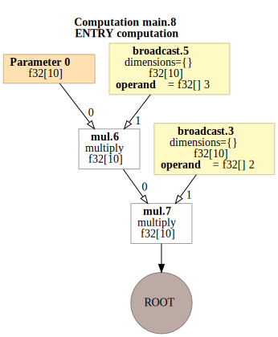

# Quick Start

## Basic Usage

The main interface is the `show()` function that takes a JAX function and its arguments:

```python
import jax.numpy as jnp
from visu_hlo import show

def simple_function(x):
    return x * 2 + 1

# Visualize the function
show(simple_function, jnp.array([1.0, 2.0, 3.0]))
```

This will:
1. Compile the function to HLO
2. Generate a DOT graph representation
3. Convert it to SVG format
4. Display it using your system's default SVG viewer

## JIT vs Non-JIT Functions

visu-hlo automatically detects whether a function is jitted and uses the appropriate visualization method:

### Original Function
```python
def func(x):
    return 3 * x * 2

show(func, jnp.ones(10))  # Shows HLO for compilation
```

The non-jitted function shows the computation graph as JAX would compile it:




### Jitted Function
```python
from jax import jit

@jit
def jitted_func(x):
    return 3 * x * 2

show(jitted_func, jnp.ones(10))  # Shows optimized HLO
```
The jitted function shows the optimized computation graph after JIT compilation:


### Key Differences

When comparing the two visualizations:

1. **Optimization**: The jitted version may show fused operations
2. **Constant Folding**: Constants like `3 * 2 = 6` may be pre-computed
3. **Memory Layout**: Different memory access patterns may be visible
4. **Operation Count**: Fewer nodes in the optimized version

## Function Arguments

You can pass multiple arguments and keyword arguments:

```python
def multi_arg_func(x, y, scale=1.0):
    return (x + y) * scale

show(multi_arg_func, jnp.ones(5), jnp.zeros(5), scale=2.0)
```

## Understanding the Output

The generated SVG shows:
- **Nodes**: Operations (add, multiply, etc.)
- **Edges**: Data flow between operations
- **Colors**: Different operation types
- **Labels**: Operation names and shapes

Each node contains:
- Operation name (e.g., `add.1`, `mul.2`)
- Input/output shapes
- Source location in your code (when available)
